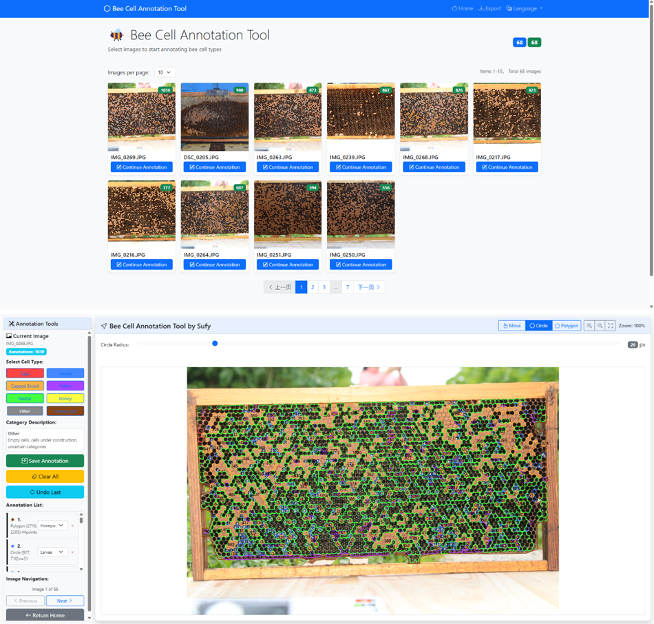

# Bee Cell Annotation Tool

[English](#english-version) | [中文](#中文版本)

---

## English Version

### Overview
Bee Cell Annotation Tool is a lightweight web app for labeling honeycomb cell types. It supports fast annotation, bilingual UI, and clean data exports for research teams.

### Acknowledgments
- Anhui Academy of Agricultural Sciences, Sericulture Research Institute — Teachers Dai Junjun and Sun Xin for their apiculture research guidance.

### Highlights
- Eight predefined cell categories covering common hive conditions.
- One-click language toggle between English and Chinese.
- Circle and polygon drawing with undo, redo, and quick save.
- Paginated gallery for navigating large image sets.
- JSON and CSV exports for downstream workflows.

### Screenshot


*Combined preview showing the dashboard and the annotation workspace.*

### Quick Start
1. Clone and install:
   ```bash
   git clone https://github.com/your-username/bee-cell-annotation.git
   cd bee-cell-annotation
   pip install -r requirements.txt
   ```
2. Copy the environment template and edit values:
   ```bash
   cp .env.example .env
   ```
3. Run the server:
   ```bash
   python run.py
   ```
   or
   ```bash
   python src/main.py
   ```
4. Visit `http://localhost:5006`.

**Docker option**
```bash
docker build -t bee-annotation .
docker run -p 5006:5006 -v $(pwd)/data:/app/data bee-annotation
```

### Usage
- Add images (JPG/JPEG/PNG/BMP/TIFF) to `data/images`.
- Select a cell type, draw with circle or polygon tools, save with `Ctrl+S`.
- Switch images via on-screen arrows or `Ctrl+← / Ctrl+→`.
- Export annotations through the **Export** button (JSON or CSV).

### API
- `GET /api/stats` — overall annotation statistics.
- `POST /api/save_annotation` — submit annotations for an image.
- `GET /api/export?format=json` — export annotations (`json` or `csv`).
See [docs/API.md](docs/API.md) for details.

### License
Released under the MIT License. See [LICENSE](LICENSE).

---

## 中文版本

### 概述
蜂巢细胞标注工具是一款精简的 Web 应用，用于快速标注蜂巢中的细胞类型，支持双语界面和数据导出，方便科研团队协作。

### 致谢
- 特别感谢安徽省农业科学院蚕桑研究所的代君君老师与孙欣老师，他们的蜜蜂科研经验给予本项目关键支持。

### 核心亮点
- 预置八类常见蜂巢细胞，命名规范统一。
- 顶部按钮一键切换中英文界面。
- 提供圆形与多边形绘制工具，支持撤销、重做与快捷保存。
- 图库分页浏览，适合批量处理大量图像。
- 支持 JSON、CSV 导出，便于后续数据分析。

### 界面预览


*该合成图展示了主页面仪表盘与标注工作区。*

### 快速上手
1. 克隆仓库并安装依赖：
   ```bash
   git clone https://github.com/your-username/bee-cell-annotation.git
   cd bee-cell-annotation
   pip install -r requirements.txt
   ```
2. 复制示例环境文件并按需修改：
   ```bash
   cp .env.example .env
   ```
3. 启动服务：
   ```bash
   python run.py
   ```
   或者
   ```bash
   python src/main.py
   ```
4. 打开浏览器访问 `http://localhost:5006`。

**Docker 方案**
```bash
docker build -t bee-annotation .
docker run -p 5006:5006 -v $(pwd)/data:/app/data bee-annotation
```

### 使用指南
- 将 JPG/JPEG/PNG/BMP/TIFF 图片放入 `data/images` 目录。
- 选择细胞类型，使用圆形或多边形工具绘制，按 `Ctrl+S` 保存。
- 通过界面箭头或 `Ctrl+← / Ctrl+→` 切换图片。
- 点击 **Export** 按钮，可导出 JSON 或 CSV 标注文件。

### 接口摘要
- `GET /api/stats` —— 查看整体标注统计。
- `POST /api/save_annotation` —— 保存单张图片的标注数据。
- `GET /api/export?format=json` —— 导出标注结果（`json` 或 `csv`）。
详细说明见 [docs/API.md](docs/API.md)。

### 许可证
本项目采用 MIT 许可证，详见 [LICENSE](LICENSE)。
